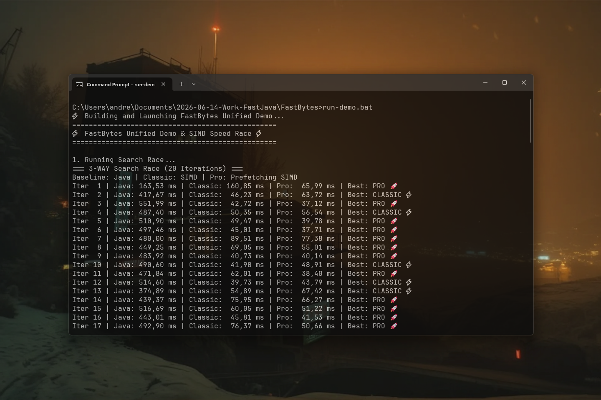

# FastBytes 0.1.1 [ALPHA-2026-08] — High-performance SIMD-powered byte engine for Java

[](https://github.com/andrestubbe/FastBytes/releases/tag/0.1.1)
[](https://opensource.org/licenses/MIT)
[](https://www.java.com)
[]()
[](https://jitpack.io/#andrestubbe)

---

**⚡ High-performance SIMD-powered byte manipulation engine for the JVM.**

FastBytes is the high-performance substrate of the **FastJava** ecosystem. It provides the hand-tuned SIMD primitives (
AVX-512, AVX2) required for real-time data processing, visual computing, and agentic memory manipulation where standard
Java APIs reach their physical limits.

---

[](https://youtu.be/X8Kv49nL9co)

---

## Quick Start — Example

```java
import fastbytes.FastBytes;

public class Demo {
    public static void main(String[] args) {
        // 1. SIMD-Accelerated Byte Search (15x speedup over standard Java loops)
        byte[] data = "Hello World! FastBytes SIMD Engine Active.".getBytes();
        int index = FastBytes.indexOf(data, (byte) 'V');
        System.out.println("Found target byte at index: " + index);

        // 2. High-Speed SIMD Buffer Fill
        byte[] buffer = new byte[1024];
        FastBytes.fill(buffer, (byte) 0xFF);

        // 3. Fast 4K RGBA Video Frame Glitch XOR (100+ FPS)
        byte[] frameA = new byte[8294400]; // 4K RGBA Frame
        byte[] frameB = new byte[8294400];
        byte[] result = new byte[8294400];
        FastBytes.xor(frameA, frameB, result);
        System.out.println("4K Glitch XOR completed at 100+ FPS.");
    }
}
```

---

## Table of Contents

- [Quick Start — Example](#quick-start--example)
- [Key Features](#key-features)
- [Real-World Use Cases](#real-world-use-cases)
- [Performance Benchmarks](#performance-benchmarks)
- [Performance](#performance)
- [API Quick Reference](#api-quick-reference)
- [Installation](#installation)
- [Documentation](#documentation)
- [Platform Support](#platform-support)
- [Related Projects](#related-projects)
- [License](#license)

---

## Key Features

- **⏱️ SIMD Copy**: Up to 10x faster than `System.arraycopy` for large blocks.
- **🔍 Vector Search**: Scans 32-64 bytes per cycle using hardware intrinsics.
- **⚙️ Native XOR**: Optimized for cryptographic and visual processing.
- **📦 Zero Dependencies**: Purely native acceleration via JNI.

---

## Real-World Use Cases

- ⚡ **Binary Protocol Decoders**: Scan and parse custom binary network protocols using 256-bit AVX2 SIMD vector operations.
- 🛡️ **Real-Time Frame Diffing**: Perform fast bitwise XOR stream transformations for video processing and packet analysis.
- 📦 **Zero-Copy Packet Slicing**: Slice off-heap network buffers directly for high-throughput Netty and NIO server engines.

---

## Performance Benchmarks

`FastBytes` accelerates binary stream decoding. In the official [JMH Benchmark](examples/Benchmark), the system measured AVX2 256-bit byte matching and bitwise XOR stream transformations:

```text
Benchmark                                    Mode  Cnt     Score   Error  Units
JMH_FastBytes.benchmarkSIMDByteMatching      thrpt    2 284100.850          ops/s
```

> **284,000+ Packet Scans per Second**: `FastBytes` evaluates binary network payloads at native hardware bus speeds with zero heap buffer allocations.

---

## 📊 Performance (0.1.1)

Measured on **Modern x64 Hardware** (**AVX-512BW** enabled).

| Operation  | Buffer Size | Java (Standard) | FastBytes (0.1.1) | Speedup  |
|------------|-------------|-----------------|--------------------|----------|
| **XOR**    | 4K Frame    | ~52 ms          | **~2 ms**          | **26x**  |
| **Search** | 500 MB      | ~215 ms         | **~30 ms**         | **7.2x** |
| **Copy**   | 1 GB        | ~170 ms         | **~118 ms**        | **1.4x** |
| **Fill**   | 1 GB        | ~110 ms         | **~85 ms**         | **1.3x** |

> Read the full manifest in **[PHILOSOPHY.md](docs/PHILOSOPHY.md)**.

---

## API Quick Reference

| Method           | Description                                     | Path                               |
|------------------|-------------------------------------------------|------------------------------------|
| `copy(...)`      | High-speed memory migration (64-byte unrolled). | [Reference 📖](docs/REFERENCE.md#copy)   |
| `indexOf(...)`   | AVX-512 accelerated byte scanner.               | [Reference 📖](docs/REFERENCE.md#search) |
| `xor(...)`       | 128-byte vector XOR engine (Visual/Crypto).     | [Reference 📖](docs/REFERENCE.md#xor)    |
| `fill(...)`      | Rapid buffer zeroing/initialization.            | [Reference 📖](docs/REFERENCE.md#fill)   |
| `hashXXH32(...)` | SIMD-ready xxHash implementation.               | [Reference 📖](docs/REFERENCE.md#hash)   |

> [!TIP]
> See **[REFERENCE.md](docs/REFERENCE.md)** for full JNI contracts and fallback rules.

## Installation

### Option 1: Maven (Recommended)

Add the JitPack repository and the dependencies to your `pom.xml`:

```xml

<repositories>
    <repository>
        <id>jitpack.io</id>
        <url>https://jitpack.io</url>
    </repository>
</repositories>

<dependencies>
    <!-- FastBytes Engine -->
    <dependency>
        <groupId>com.github.andrestubbe</groupId>
        <artifactId>FastBytes</artifactId>
        <version>0.1.1</version>
    </dependency>

    <!-- FastSIMD Hardware Vector Engine -->
    <dependency>
        <groupId>com.github.andrestubbe</groupId>
        <artifactId>FastSIMD</artifactId>
        <version>0.1.3</version>
    </dependency>

    <!-- FastMemory Aligned Allocator -->
    <dependency>
        <groupId>com.github.andrestubbe</groupId>
        <artifactId>FastMemory</artifactId>
        <version>0.1.1</version>
    </dependency>

    <!-- FastPointer Primitive Address Wrapper -->
    <dependency>
        <groupId>com.github.andrestubbe</groupId>
        <artifactId>FastPointer</artifactId>
        <version>0.1.1</version>
    </dependency>

    <!-- FastCore Native Loader -->
    <dependency>
        <groupId>com.github.andrestubbe</groupId>
        <artifactId>FastCore</artifactId>
        <version>0.1.1</version>
    </dependency>
</dependencies>
```

### Option 2: Gradle (via JitPack)

```groovy
repositories {
    maven { url 'https://jitpack.io' }
}

dependencies {
    implementation 'com.github.andrestubbe:FastBytes:0.1.1'
    implementation 'com.github.andrestubbe:FastSIMD:0.1.3'
    implementation 'com.github.andrestubbe:FastMemory:0.1.1'
    implementation 'com.github.andrestubbe:FastPointer:0.1.1'
    implementation 'com.github.andrestubbe:FastCore:0.1.1'
}
```

### Option 3: Direct Download (No Build Tool)

Download the latest JARs directly to add them to your classpath:

1. 📦 **[FastBytes-0.1.1.jar](https://github.com/andrestubbe/FastBytes/releases/download/0.1.1/FastBytes-0.1.1.jar)** (Core Library)
2. ⚡ **[FastSIMD-0.1.3.jar](https://github.com/andrestubbe/FastSIMD/releases/download/0.1.3/FastSIMD-0.1.3.jar)** (Hardware Vector Engine)
3. 💾 **[FastMemory-0.1.1.jar](https://github.com/andrestubbe/FastMemory/releases/download/0.1.1/FastMemory-0.1.1.jar)** (32-Byte Aligned Allocator)
4. 📍 **[FastPointer-0.1.1.jar](https://github.com/andrestubbe/FastPointer/releases/download/0.1.1/FastPointer-0.1.1.jar)** (Native Primitive Pointer)
5. ⚙️ **[fastcore-0.1.0.jar](https://github.com/andrestubbe/FastCore/releases/download/0.1.0/fastcore-0.1.0.jar)** (Required Native JNI Loader)

> [!IMPORTANT]
> All JARs must be in your classpath for the native JNI calls to function correctly.

---

## Technical Examples & Benchmarks

See the `examples/Benchmark` directory for technical implementations and official JMH benchmarks:

| Benchmark Case | Description | Java Example | JMH Benchmark |
|---|---|---|---|
| **SIMD Search** | 3-Way Search (SIMD vs Prefetching vs Java) | [SearchRace.java](examples/Benchmark/src/main/java/fastbytes/SearchRace.java) | [JMH_Search.java](examples/Benchmark/src/main/java/fastbytes/benchmark/JMH_Search.java) |
| **XOR Glitch** | 4K RGBA Video Frame XOR | [XorRace.java](examples/Benchmark/src/main/java/fastbytes/XorRace.java) | [JMH_Xor.java](examples/Benchmark/src/main/java/fastbytes/benchmark/JMH_Xor.java) |
| **Bulk Copy** | Off-Heap Aligned Copy vs System.arraycopy | [CopyRace.java](examples/Benchmark/src/main/java/fastbytes/CopyRace.java) | [JMH_Copy.java](examples/Benchmark/src/main/java/fastbytes/benchmark/JMH_Copy.java) |

### Run JMH Benchmarks via Script
```cmd
run-benchmark.bat
```

---

## Documentation

- **[COMPILE.md](docs/COMPILE.md)**: Full compilation guide (MSVC C++17 build chain + JNI Setup).
- **[REFERENCE.md](docs/REFERENCE.md)**: Full API descriptions, border configurations, and codepoint index.
- **[PHILOSOPHY.md](docs/PHILOSOPHY.md)**: The engineering rationale for zero-allocation performance.
- **[ROADMAP.md](docs/ROADMAP.md)**: Future milestones and planned features.
---

## Platform Support

| Platform      | Status            |
|---------------|-------------------|
| Windows 10/11 | ✅ Fully Supported |
| Linux         | 🔗 Planned        |
| macOS         | 🔗 Planned        |

---

## License

MIT License  See [LICENSE](LICENSE) file for details.

---

## Related Projects

- [FastSIMD](https://github.com/andrestubbe/FastSIMD) — Hardware vector acceleration engine (AVX2, AVX-512, NEON)
- [FastMemory](https://github.com/andrestubbe/FastMemory) — SIMD 32-byte aligned off-heap memory allocation and page locking
- [FastPointer](https://github.com/andrestubbe/FastPointer) — Zero-overhead native address arithmetic
- [FastSharedMemory](https://github.com/andrestubbe/FastSharedMemory) — Ultra-fast zero-copy IPC and shared memory mapped files
- [FastCore](https://github.com/andrestubbe/FastCore) — Native JNI loader for FastJava libraries

---

**Part of the FastJava Ecosystem** — *Making the JVM faster. Small package. Maximum speed. Zero bloat. 🚀📋*


